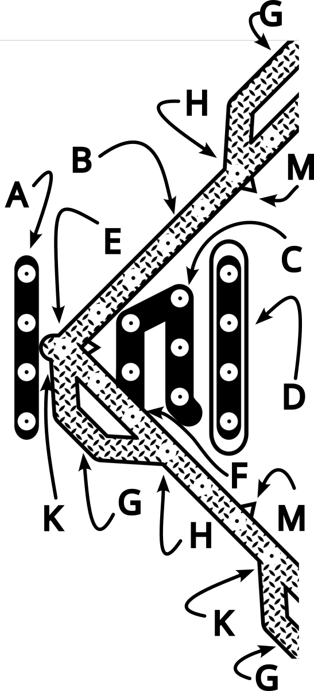

# A peg and card game of revenge

Copyright © Crane Softwrights Ltd. ([copyright details](../LICENSE))  
Development: [`https://github.com/CraneSoftwrights/revenge`](https://github.com/CraneSoftwrights/revenge)  
Tip jar: [`https://paypal.me/CraneSoftwrights`](https://paypal.me/CraneSoftwrights)  
Browser pages: [`https://cranesoftwrights.github.io/revenge/en/README.md.html`](https://cranesoftwrights.github.io/revenge/en/README.md.html)  

### Table of contents
- [1 Introduction](#1-introduction)
- [2 The board](#2-the-board)
- [3 The deal](#3-the-deal)
- [4 The play](#4-the-play)
- [5 The win](#5-the-win)
- [6 The cards](#6-the-cards)
- [7 The characters](#7-the-characters)
- [8 Game design process](#8-game-design-process)
- [9 Print, board, and box representations](#9-print-board-and-box-representations)  

## 1 Introduction

Revenge at Hay Lake is a race to the finish, driven by good-natured vengeance against your opponents. 

As one of four, three, or even just two players, be the first to get all your four pegs from your start zone to your end zone, without being afraid to take revenge on any player that gets in your way.

Strategize the playing of your cards to move your pegs to optimize the results of your moves on your way to win. 

Note: You can <a href="https://www.makeplayingcards.com/sell/cranesoftwrights" target="_blank">buy a custom deck of Revenge at Hay Lake cards</a> direct from Crane's supplier 

## 2 The board

### 2.1 Legend

The following terminology is used in English:

| Legend | Key |
| ---- | ---- |  
| **A** = start zone  **B** = play zone  **C** = safe zone  **D** = end zone  **E** = start point  **F** = safe zone entry point  **G** = sweep zone  **H** = sweep zone entry point  **K** = sweep zone exit point  **M** = counting notches |  |  

### 2.2 Player zones

Players begin with all four of their pegs in their respective start zone. There is no order to removing pegs from the start zone.

Players proceed around the play zone, typically though not always in the clockwise direction.

Players enter their safe zone from their safe zone entry point when moving clockwise (not when moving counterclockwise), without needing to complete their turn at their safe zone entry point, and head towards their end zone.

Players in the safe zone are protected from revenge and from swaps.

A counterclockwise move for players in the safe zone backs them out of the safe zone into the vulnerable play zone counterclockwise from the safe zone entry point. Players in the end zone cannot play counterclockwise moves out of the end zone, as the end zone is separated from the safe zone.

Players enter the end zone based on the nature of the win that has been agreed upon before the start of the game. See <a href="#5-the-win">5 The win</a> for details.

### 2.3 Sweep zones

  

The sweep zones dictate special behaviours that may be available when the end of one of your plays is at a sweep zone entry point, but only if your peg arrives at that point on the last move of the play:

- if any of your own pegs are covered by the sweep zone you have arrived at, you are not allowed to sweep your peg to the sweep zone exit point
- if you choose, you can automatically sweep your peg to the sweep zone exit point, though typically you would not want to do this if you are at the sweep zone entry point one hole before your safe zone entry point
- should you choose to sweep past the play zone holes covered by the sweep zone, any opponents' pegs are sent back to their start zone
- pegs in the safe zone are not swept should an opponent sweep past the safe zone entry point
- a player with a peg at their safe zone entry point is vulnerable in a sweep zone; an opponent is allowed to sweep their peg back to their start as the safe zone entry point is not, itself, safe from being swept

A special note about the play of the "7" card: that dictates seven separate completed plays of one move each and so any number of those plays would qualify for consideration at a sweep zone entry point because each move of one is considered completed. There are circumstances where this card permits the player to sweep more than one zone in a single play.

## 3 The deal

  

A standard deck of 54 cards, including 52 suit cards and 2 jokers, is shuffled when the deal begins for a dealer.

The first dealer is determined by some agreed-upon method, one of which is just revealing one card for each player and the high card wins (aces are lowest and jokers are highest). Subsequent dealers take turns clockwise from the first dealer once the dealer has made it through the deck of cards.

When playing four players, the first deal is five cards per player and subsequent deals are four cards per player.  All cards end up being played in three rounds unless one or both of the last two cards are jokers.

When playing three players, again the first deal is five cards per player and subsequent deals are four cards per player. All but one of the cards end up being played in four rounds unless one or two of the last three cards are jokers.

When playing two players, the deal changes slightly with the first two deals being five cards per player and the subsequent deals being four cards per player. All cards end up being played in six rounds unless one or both of the last two cards are jokers.

When a card is played, it is shown first to all opponents and then discarded face down in the centre discard pile. The player proceeds then to act on the card being played. Should it be proven that the card in fact cannot be played, it is retrieved from the discard and put back into the player's hand. Discarded cards that are successfully played are not reused until the next dealer shuffles.

At the end of a deal, all unplayed cards are discarded face down without being revealed to opponents. Any undealt cards also are discarded face down. The discarded cards are gathered and passed clockwise to the next dealer.

## 4 The play

The play begins with the player to the dealer's left and continues clockwise. Each round finishes when the dealer makes their play. Rounds continue until one or more players win during the last round.

Reviewing the cards dealt to them in their hands (See <a href="6-the-cards">6 The cards</a> for details), some cards represent one or more "qualifying moves" that can be played. A qualifying move is determined by the ability for a player's peg to occupy the last hole that satisfies one of the candidate plays described on the card. If the peg to be moved cannot occupy the last hole dictated by the move, then the move is not qualified.

At their turn, players choose which of the qualified moves available in their hand to play. Players cannot "pass", that is, if there is a qualified move in their hand they are obliged to play it, even if it is strategically inconvenient. An example is having to move back out of the safe zone and into the play zone.

A player without any qualified moves in their hands simply declares something along the lines of "I cannot play." Note that the cards in their hand may become playable once play returns to them based on changes made in the play area in the plays in between. Note also that it is not uncommon for a player to be unable to play for the entire duration of the deal. Woe to the player who is dealt such a hand repeatedly time and again (it happens!). While not mandatory, a player who has only cards that can never be played regardless of changes on the board may choose to discard them at any time to remind other players not to wait for them to say they cannot play.

A player's candidate move is not qualified if it should end at a hole occupied by themselves. A card with more than one candidate move does not need all moves to be qualified, as any one qualified move on the card allow the card to be played with that move. 

A player takes revenge on an opponent by completing their play at a hole already occupied by that opponent. The opponent's peg must be returned to the opponent's start zone.

When playing a given numbered advance, the holes counted may be empty or occupied by anyone. The only governing issue is the occupation of the hole at the very end of the play.

The player shows their qualifying play card to their opponents before discarding it, face down, on the discard pile. When the hand is completed, if they have not already done so, all players still holding their unqualified cards discard them face down in the discard pile without revealing them to opponents (to prevent card counting).

### 4.1 The start

  

A player playing the star moves a peg from their start zone to their start point, provided their start point is not occupied by themselves. If their start point is occupied by an opponent, the player takes revenge on the opponent and sends their peg back to their opponent's start zone.

### 4.2 Revenge!

  

A player playing the exclamation point (or "bang") takes revenge on an opponent by moving one of their pegs from their start zone to the hole in the play zone that is occupied by the opponent. This returns the opponent's peg back to the opponent's start zone. To take revenge in this manner the player's peg must come from their start zone and not from any other of their zones.

### 4.3 The swap

  

A player playing the hash (or "pound", or "octothorpe") swaps the positions of any two pegs in the play zone, be they their own pegs and/or the pegs of their opponents.

All pegs in the start, safe, and end zones are protected from being swapped.

## 5 The win

  

The winning players are the first to get all of their pegs into their end zone in the last round of the game. If the player that finishes first is not the dealer, the final round continues until the dealer has their play. This ensures all players end the game having played the same number of rounds. The winners are those players who finished during the final round.

Before the game begins, all players must agree on the rules for filling the end zone.

### 5.1 The easy win

When playing for the easy win, simply getting past the safe zone puts one in the end zone, even if there are unused moves in the play.

Any pegs in the safe zone do not block another peg from stepping over and continuing its play after counting the occupied hole.

An easy-win game with four players appears to last between 20 and 50 minutes. 

### 5.1 The typical win

When playing for the typical win, a play is qualified only if its very last step steps into the end zone from the safe zone. There is no order on filling the end zone.

Any pegs in the safe zone do not block another peg from stepping over and continuing its play after counting the occupied hole.

A typical win game with four players appears to last just over an hour.

### 5.2 The difficult win

When playing for the difficult win, the holes of the end zone are counted in the play as an extension of the safe zone. Pegs make their way to the left of the end zone and may end up sitting for a while unfinished to the right of unoccupied holes to their left in the end zone.

Importantly, pegs in the safe zone and end zone block one's pegs from stepping over and continuing steps and so disqualifies the play. This drastically reduces the number of qualifying plays and can stretch the length of the game quite a bit.

A difficult win game with four players appears to last about two hours.

## 6 The cards

Any standard playing card deck, 52 cards plus 2 jokers, can be used to play the game. You can <a href="https://www.makeplayingcards.com/sell/cranesoftwrights" target="_blank">buy a custom deck of Revenge at Hay Lake cards</a> direct from Crane's supplier. The custom deck includes standard suits and so can be used for standard card games.

Each card has one or more plays, and each play involves one or more moves.

<!--
<table style="table-layout: fixed; width: 100%;">
  <col width="25%"/>
  <col width="23%"/>
  <col width="4%"/>
  <col width="23%"/>
  <col width="25%"/>
  <tr>
    <td valign="top" align="left"></td><td valign="top" align="left">Ace: Either move one peg one forward, or move a peg out of the start zone to the start point </td><td> </td><td valign="top" align="left">8: Move one peg eight forward </td><td valign="top" align="right"></td></tr><tr>
    <td valign="top" align="left"></td><td valign="top" align="left">2: Move one peg two forward and if that does not win the game then play another card from the player's hand </td><td> </td><td valign="top" align="left">9: Move one peg nine forward </td><td valign="top" align="right">
  </td></tr><tr>
    <td valign="top" align="left"></td><td valign="top" align="left">3: Move one peg three forward</td><td> </td><td valign="top" align="left">10: Move one peg either forward ten or backward one</td><td valign="top" align="right">
  </td></tr><tr>
    <td valign="top" align="left"></td><td valign="top" align="left">4: Move one peg four backward</td><td> </td><td valign="top" align="left">Jack: Either take revenge on an opponent from one's start zone, or swap the positions of any two pegs in the play zone</td><td valign="top" align="right">
  </td></tr><tr>
    <td valign="top" align="left"></td><td valign="top" align="left">5: Move one peg five forward</td><td> </td><td valign="top" align="left">Queen: Move one peg twelve foward</td><td valign="top" align="right">
  </td></tr><tr>
    <td valign="top" align="left"></td><td valign="top" align="left">6: Move one peg six forward</td><td> </td><td valign="top" align="left">King: Either move a peg out of the start zone to the start point, or move a peg thirteen forward</td><td valign="top" align="right">
  </td></tr><tr>
    <td valign="top" align="left">                                                                   </td><td valign="top" align="left">7: Seven separate moves of any peg one forward; Each move of one is considered a complete move; The game is permitted to end on any of the seven moves and does not require all seven moves to be played</td><td> </td><td valign="top" align="left">Joker: Take the top card from the deal and then either take revenge on an opponent from one's start zone or move one peg twenty-five forward</td><td valign="top" align="right">                                                                   </td></tr>
</table>

-->

<table style="table-layout: fixed; width: 100%;">
  <col width="25%"/>
  <col width="23%"/>
  <col width="4%"/>
  <col width="23%"/>
  <col width="25%"/>
  <tr>
    <td valign="top" align="left"></td>
    <td valign="top" align="left">Ace: Either move one peg one forward, or move a peg out of the start zone to the start point </td>
    <td> </td>
    <td valign="top" align="left">8: Move one peg eight forward </td>
    <td valign="top" align="right"></td>
  </tr>
  <tr>
    <td valign="top" align="left"></td>
    <td valign="top" align="left">2: Move one peg two forward and if that does not win the game then play another card from the player's hand </td>
    <td> </td>
    <td valign="top" align="left">9: Move one peg nine forward </td>
    <td valign="top" align="right"></td>
  </tr>
  <tr>
    <td valign="top" align="left"></td>
    <td valign="top" align="left">3: Move one peg three forward</td>
    <td> </td>
    <td valign="top" align="left">10: Move one peg either forward ten or backward one</td>
    <td valign="top" align="right"></td>
  </tr>
  <tr>
    <td valign="top" align="left"></td>
    <td valign="top" align="left">4: Move one peg four backward</td>
    <td> </td>
    <td valign="top" align="left">Jack: Either take revenge on an opponent from one's start zone, or swap the positions of any two pegs in the play zone</td>
    <td valign="top" align="right"></td>
  </tr>
  <tr>
    <td valign="top" align="left"></td>
    <td valign="top" align="left">5: Move one peg five forward</td>
    <td> </td>
    <td valign="top" align="left">Queen: Move one peg twelve forward</td>
    <td valign="top" align="right"></td>
  </tr>
  <tr>
    <td valign="top" align="left"></td>
    <td valign="top" align="left">6: Move one peg six forward</td>
    <td> </td>
    <td valign="top" align="left">King: Either move a peg out of the start zone to the start point, or move a peg thirteen forward</td>
    <td valign="top" align="right"></td>
  </tr>
  <tr>
    <td valign="top" align="left">                                               </td>
    <td valign="top" align="left">7: Seven separate moves of the same or any different peg each time one forward; Each move of one is considered a complete move; accordingly, the game is permitted to end on any of the seven moves and does not require all seven moves to be played</td>
    <td> </td>
    <td valign="top" align="left">Joker: Take the top card from the deal and then either take revenge on an opponent from one's start zone or move one peg twenty-five forward</td>
    <td valign="top" align="right">                                               </td>
  </tr>
</table>

### 7 The characters

Four characters familiar around Hay Lake are portrayed in the board and in the cards: air, water, land, and human.

 - loon can be seen and heard most days while at the lake

 - trout is a popular catch by anglers on the lake

 - fox are seen quite often, as well as a lot of other wildlife

 - residents and visitors alike enjoy kayaking, canoeing, boating, and swimming

These characters don't have any impact on the game play, they are just thematic reminders of the pleasures of Hay Lake.

## 8 Game design process

See the [design resources](design.md) for information regarding the design files and the initial steps in creating a release of files.

## 9 Print, board, and box representations

### 9.1 Print representations

Print to paper the playing surface using this PNG file at 248mm x 248mm dimension, centred in a 10"x10" box, with a small unused margin of approximately .28in or 7mm around all four printing extents:

- [Play surface ](../shared/revenge-crane.png)

When printing, use A3 paper or US Tabloid 11x17 paper to avoid shrinking the playing surface.

### 9.2 Board and box representations

For the PDF burn files for laser cutters, see the [releases page](https://github.com/CraneSoftwrights/revenge/releases) for ZIP collections of all of the PDF, PNG, and SVG files created from the design files:
- SBF Single board front layer (SBFx has peg holes marked for drilling, but not burned through)
- SBB Single board front layer
- DBF Double board front layer (DBFx has peg holes marked for drilling, but not burned through)
- DBB Double board back layer (same as L9)
- L1 through L4 Multiple board play layers with peg holes
- L5 Multiple board storage layer, replicated as many times as needed to accommodate card and peg storage
- L9 Multiple board back layer (same as DBB)

The burn/cut images are at 248mm x 248mm dimension, centred in a 10"x10" box, with a small unused margin of approximately .14in or 3.5mm around all four cutting extents. Be sure to be precise when preparing the wood for burning and cutting.

The peg holes are approximately 1/8" or 3mm wide, suitable for typical cribbage board pegs.

### 9.3 Creating all the representations

To build new versions of the board and box representations, see the [building instructions](build.md) for how the laser burn image files in the releases ZIP collections are created from the design files.

### 9.4 Reviewing and using all the representations

See the [burn directory](../burn) and [burn README](burn.md) for a collection of SVG and PNG image files of game board and box layer materials. In the releases page ZIP collections these repository files are included with the PDF burn files. The PDF burn files are not part of the git repository because unchanged republished PDF files bloat the repository due to immutable PDF metadata differences in every replacement file.

### 9.5 Handy cutting files for preparing materials

See the [cuts directory](../cuts) and [cuts README](cuts.md) for a collection of image files for laser cutting of raw materials in preparation for engraving and cutting of game boards and box layers.

### 9.6 Shared images used in documentation

See the [shared directory](../shared) and [shared README](shared.md) for a collection of images used in documentation.
